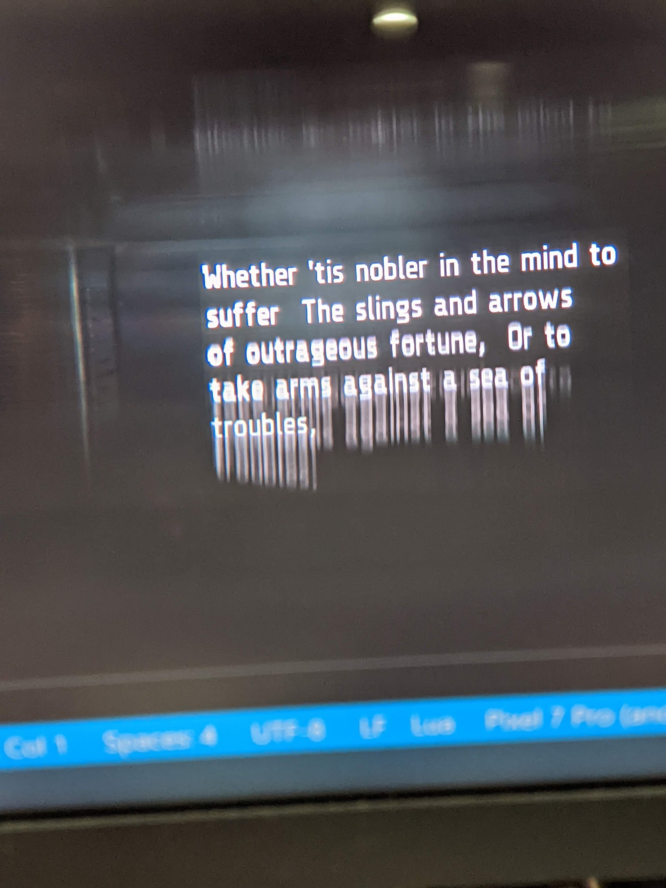
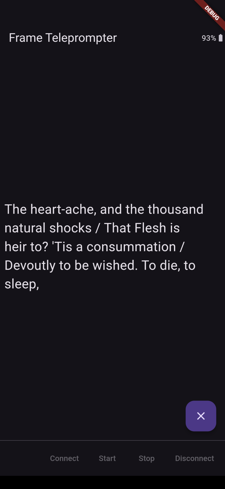

# Teleprompter for Frame

Simple teleprompter that loads a text file picked from the user's device and sends one line at a time for display on Frame.

Next/Previous paging through content is done via a vertical swipe up or down anywhere on the application screen.

As a result, bluetooth page-turning (and "tiktok scrolling") rings can be used for paging forward and backward, since they (some of them, at least) connect as a HID device imitating a mouse, and perform a click and drag up/down over a certain region of the display.

For a sample text file, [to_be_or_not_to_be.txt](assets/to_be_or_not_to_be.txt) is provided in this repo, although it isn't used at runtime by Flutter. Instead, download this file to your device Downloads folder and pick it when running the app (or any other .txt file of your choosing).

### Frameshots

### Screenshots

### Architecture
